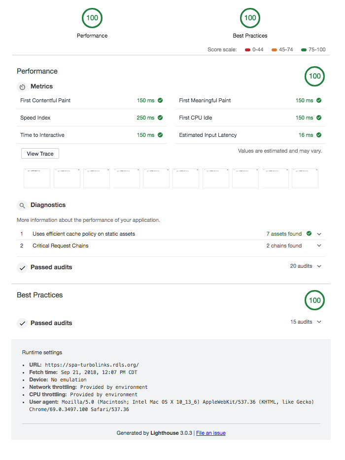

An implementation of a SPA using turbolinks with React "panels"

# [Demo](https://spa-turbolinks.rdls.org/)

### Concept

Use plain old Rails views with a [tiny bit of JS](app/javascript/panels/attach.js) that will:

 * Watch turbolinks page navigation and after a page loads:
   * Search the DOM for elements that have a "[data-react-panel]" selector
   * When found, dynamically load a webpack chunk and render the it inside the element
      * the element's `dataset` attributes are passed to the component as properties
 * The "Panels" are marked as static so that Turbolinks will not re-render them
   * However that doesn't mean that it NEVER will.  When a new page loads, turbolinks inspects it and if an element with the same panel id is present, the static panel will be left alone.  If the ID isn't present on the new page, turbolinks will remove the static panel.
      * This is both good and bad, because it means that we can do things like only show the TOC for book content.
 * Book pages view are cached to using https://github.com/rails/actionpack-page_caching and the complete HTML file is served by nginx

Interesting bits of code:

  * [book controller](app/controllers/book_controller.rb) that renders pages
  * the navbar [react panel](app/javascript/panels/navbar.js) and [view](app/views/application/_navbar.html.erb)
  * [highlighter](app/javascript/panels/highlighting.js)
  * the table of contents menu [react](app/javascript/panels/book-toc-menu.js) and [view](app/views/application/_book_toc_menu.html.erb) that gives it the JSON as a prop


### Bencharks:

Surprisingly, https is faster, most likely because nginx has http2 enabled

```

siege -c50 -d5 -t60S -i -f siege-https.txt --no-parse
Transactions:               1219 hits
Availability:               100.00 %
Elapsed time:                59.80 secs
Data transferred:            17.82 MB
Response time:                0.01 secs
Transaction rate:            20.38 trans/sec
Throughput:                    0.30 MB/sec
Concurrency:                   0.31
Successful transactions:       1219
Failed transactions:              0
Longest transaction:           0.21
Shortest transaction:          0.00

siege -c50 -d5 -t60S -i -f siege-http.txt --no-parse

Transactions:               1182 hits
Availability:             100.00 %
Elapsed time:              59.12 secs
Data transferred:          17.09 MB
Response time:              0.01 secs
Transaction rate:          19.99 trans/sec
Throughput:              0.29 MB/sec
Concurrency:                0.15
Successful transactions:    1182
Failed transactions:           0
Longest transaction:        0.11
Shortest transaction:       0.00
```


## Chrome audit

Results of running with options: desktop, performance, bestpractices, no throttling, clear storage


